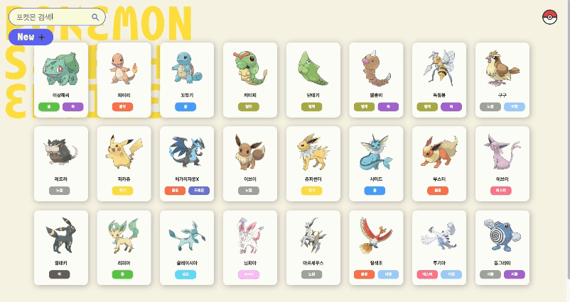

## 포켓몬 관리 사이트

### 사이트 링크
https://fekemon.netlify.app/

### 프로젝트 기간 
2024년 3월 11일 - 24일

### 개요

아들이 좋아하는 포켓몬을 관리하는 사이트를 만들면 좋을 것 같아 이번 프로젝트 주제로 정했다. 포켓몬 도감 사이트도 있고, 포켓몬 API도 있지만, 직접 새로운 디자인으로 만들고 싶었다.

### 작업 내용
1. 각각의 포켓몬을 카드 형식으로 나타내고 이름과 두 가지 타입을 표기했다. 새롭게 추가하는 포켓몬은 마지막 포켓몬 뒤에 배치된다.

2. 포켓몬 캐릭터를 빠르게 검색하기 위해 화면 왼쪽 상단에 검색창을 크게 만들었다. 

3. 바로 밑에 배치한 New 버튼을 누르면 새로운 포켓몬을 만들 수 있는 모달 창이 열리고, 사진과 내용을 입력할 수 있다.

4. 각 포켓몬 캐릭터를 클릭하면 수정과 삭제할 수 있는 모달 창이 열린다. 아쉽지만 수정과 삭제 기능은 구현하지 못했다.

5. 오른쪽 상단의 포켓몬 볼을 클릭하면 화면을 새로고침 하면서 생성한 포켓몬 캐릭터를 지우고, 로딩 화면도 다시 볼 수 있다.

6. 각 포켓몬 캐릭터 타입에 따라 색상을 다르게 지정하기 위해 타입 속성을 추가로 지정하고 CSS에서 색을 분류했다.

### 프로젝트를 진행하면서 배운 점

1. DOM 이벤트와 전반적인 JS 기능을 배울 수 있었다. 다른 예제들을 검색하고 비교 분석하면서 어떤 동작을 하는지 공부했다.
2. 아직 서투르지만 새로운 애니메이션 기능을 추가하면서 CSS를 조금 더 이해할 수 있었다.
3. 로컬 스토리지에 데이터를 넣고 가져오는 방법을 공부할 수 있었다.

### 구현하기 어려웠던 점

1. 포켓몬 수정과 삭제 기능을 내가 원하는 모달 디자인에서 구현하지 못 한 점이 아쉽다. 추후 완성하고 싶다. 
2. 스크롤이 화면 밑으로 내려가면 포켓몬 케릭터가 추가로 배치되는 구조를 만들지 못했다. 
3. 새로운 포켓몬을 생성할 때 해당 타입에 따라 색상이 변하지 않는다. input에서 받은 한글 데이터를 영문으로 변환해서 
type class를 지정하면 될 것 같다. 
4. 포켓몬 카드에 마우스를 올려서 hover시키면 NEW 버튼 위로 올라간다. 
5. 해당 포켓몬 li 태그를 클릭하면 해당 데이터를 전달해서 모달창에 나타낼 수 있을 것 같은데, 
`const showEdit = document.querySelector('ul#list')`에서 ul대신에 li로 변경하면 모달이 나오지 않는다. 
6. 다음에는 꼭 SCSS를 적용해보고 싶다. 

